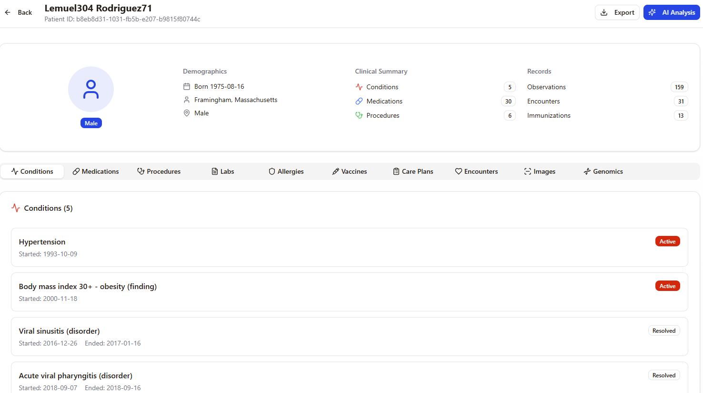

<div align="center">

# 🏥 Multimodal Agentic EHR Co-Pilot **[(Try Our Live EHR Co-Pilot)](https://doccopilot-jggvbb9h.manus.space)** 

### *Stopping the Expensive Crisis Hiding in Electronic Health Records*

[]()
[]()
[]()
[](https://github.com/jliu678/AI-x-Bio-Hackathon-Evolved-Boston-2025)

</div>


## 🚀 Try Our Live Multimodal Agentic EHR Co-Pilot
**Please visit our live web application to experience the Multimodal Agentic EHR Co-Pilot in action: [Try Our Live EHR Co-Pilot](https://doccopilot-jggvbb9h.manus.space)**

> Note: All functionalities have been tested and are fully usable. However, please bear with occasional website instability until we secure further funding to deploy it on paid cloud services. And refreshing the page will most likely overcome the instability issue.


## 📑 Table of Contents

- [🚨 The Crisis](#-1-the-crisis) — The $30B problem in healthcare
- [💡 The Solution](#-2-the-solution) — AI-powered clinical co-pilot
- [⚡ Execution](#-3-our-top-tier-execution-turn-concept-to-60m-impact-in-7-hours) — Built in 7 hours, $60M impact
- [🌟 Product Demo](#-4-vignettes) — See it in action
- [📈 Roadmap](#-roadmap--next-steps-if-further-funded) — What's next
- [❓ FAQ](#-faq) — Common questions
- [📬 Contact](#-contact-and-demo-request) — Get in touch
- [🙏 Acknowledgments](#-acknowledgments)


## 🚨 1. The Crisis

> **What if physicians could spend 5 minutes less per case on admin work and 5 minutes more on patient care?**
> 
> That's **$60M saved per hospital. Per year.** And countless burnout cases prevented.


Electronic Health Records were built to digitize care — not to distract caregivers. Today, they've become the silent crisis behind financial hemorrhage and medical waste in healthcare:

<div align="center">

| 💸 The Cost | 📊 The Impact | 😩 The Toll |
|------------|--------------|-------------|
| **$30 Billion** in annual inefficiency losses | **49%** of physician time wasted on clicks, not care | **60%** of physicians report severe burnout |

</div>

**The Problem:** Digital filing cabinets and static PDFs scattered across fragmented systems.

**The Result:** Physicians spend half their patient visits clicking, not caring.

---

## 💡 2. The Solution

An **AI-powered clinical co-pilot** that transforms EHR chaos into a unified, intelligent system that thinks, prioritizes, and acts.

### How It Works

- **📥 Ingests & Integrates** multimodal data — text, labs, images, notes — into one cohesive patient view
- **🎯 Highlights High-Priority Cases** so physicians can focus on what truly matters
- **💡 Suggests Actions awaiting physician approval** with full transparency
- **✅ Automates** (with approval) documentation, alerts, and workflows across hospital systems
- **🔍 Verifiable Reasoning** — all decisions have trackable, auditable reference data


```
┌─────────────────────────────────────────────────────────┐
│              EHR Systems (FHIR/HL7)                     │
│     (Text Records • Lab Results • Imaging • Notes)      │
└────────────────────┬────────────────────────────────────┘
                     │
          ┌──────────▼───────────┐
          │  Multimodal Ingestion │
          │  & AI Processing      │
          └──────────┬───────────┘
                     │
          ┌──────────▼───────────┐
          │   Agentic AI Engine   │
          │  • Priority Scoring   │
          │  • Action Generation  │
          │  • Reasoning Chains   │
          └──────────┬───────────┘
                     │
          ┌──────────▼───────────┐
          │ Physician Dashboard   │
          │  One-Click Approvals  │
          └───────────────────────┘
```


---

## ⚡ 3. Our Top-tier Execution: Turn Concept to $60M Impact in 7 Hours

| Milestone | Achievement |
|-----------|-------------|
| 💭 **Ideation** | Completed concept design and problem validation |
| 💻 **Prototype** | Built multimodal AI-powered web application |
| 🔁 **Iteration** | Reduce the time needed to assess case urgency: **5 minutes → seconds** |
| 💰 **Impact** | **$60M in annual savings per hospital*** |

<sub>*Conservative estimation: 1000 physicians × $60/hr × 5 minutes saved per case</sub>

### Before Our Co-Pilot:
- ❌ Physician opens 5-7 different systems
- ❌ Manually scans labs, notes, imaging
- ❌ **5+ minutes** to assess case urgency
- ❌ Repeats 20-40 times per shift

### With Our Co-Pilot:
- ✅ One unified dashboard
- ✅ AI highlights critical cases
- ✅ **Seconds** to assess priority
- To be done: Physician approves actions with one click

## 🌟 4. Vignettes
### Interface
- The first interface page of our [Multimodal Agentic EHR Co-Pilot](https://doccopilot-jggvbb9h.manus.space) shows the overview of the agentic EHR Co-Pilot.
<p align="center">
  
  <br>
  <em></em>
</p>

- Scroll down for more introductions of the features.
<p align="center">
  
  <br>
  <em></em>
</p>

### Key Feature Milestone: Assess Case Urgency at a Glance
**(A). Click on the "Analyze Patients" or "Get Started" button (shown on the above screenshots) to check all the cases in the system with color-coded urgency/priority levels as below:**

<p align="center">
  
  <br>
  <em></em>
</p>

(B). Click on one of the cases above to see the details data of the case as below:
<p align="center">
  
  <br>
  <em></em>
</p>


**(C). Highly recommend to click on "AI Analysis" button on the upper right corner of the above page (shown on the above screenshot) to see the report generated by the multimodal AI agents as below. The reports show the items that need physicians' attention and the priority level of each item.**
<p align="center">
  
  <br>
  <em></em>
</p>

---

## 📈 Roadmap & Next Steps If Further Funded

### 2025 to Q1 2026
- [ ] More stable and fast deployment using paid cloud services
- [ ] Add Agent-suggested Actions for Physician to approve
- [ ] Evaluate Agent Actions triggered by Physicians' approvals

---


## ❓ FAQ

**Q: Is this HIPAA compliant?**  
A: Our prototype uses synthetic data for training. Production deployment will be fully HIPAA-compliant with end-to-end encryption and comprehensive audit logging.

**Q: How does it integrate with existing EHR systems?**  
A: Via standard HL7/FHIR interfaces — no rip-and-replace needed. We work alongside your current infrastructure.

**Q: What about clinical liability?**  
A: The physician always reviews and approves AI recommendations. We augment decision-making, not replace it. All actions are logged and auditable.

**Q: What data was used for training?**  
A: Entirely synthetic, simulated multimodal EHRs generated to mirror real-world clinical scenarios — zero patient privacy concerns.

---


## 📬 Contact and Demo Request

- **Email**: [Cong Wang](#cwang75@mgh.harvard.edu)
- **Email**: [Jiyuan (Jay) Liu](#jliu78mghharvardedu@gmail.com)


---

<div align="center">

**Built with ❤️ by Team 10**

**Cong Wang**- **Jiyuan (Jay) Liu** - **Caleb Moulema** - **Mi Yang** - **Alex Guo**- **Hana Abbasian**- **Ravi Teja Pappala**

🚀 Our Vision: Every click we remove brings care back to the patient.


</div>

---


## 🙏 Acknowledgments

- Built during [AI x Bio Hackathon | Evolved Boston 2025]
- Special thanks to [Evolved Technology]
